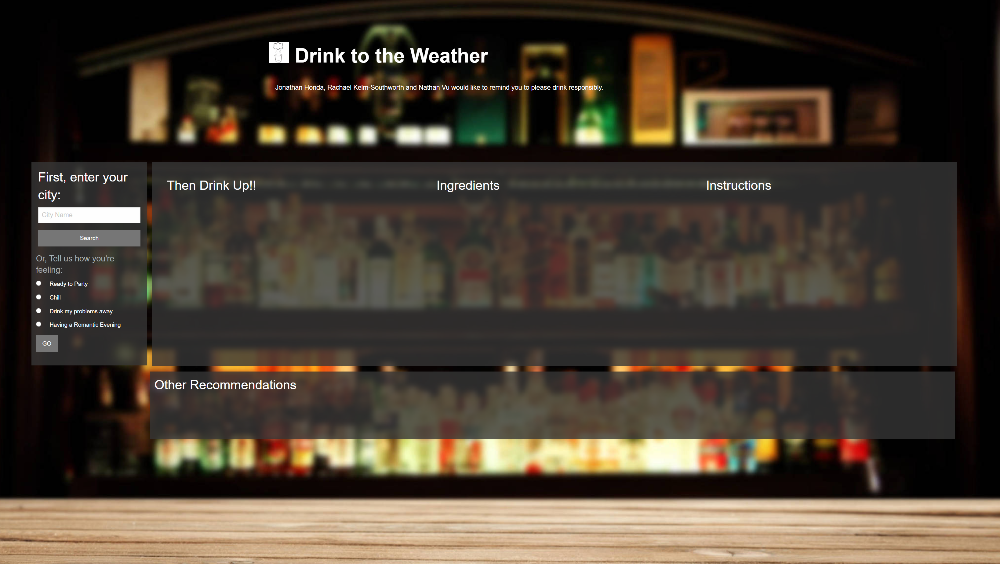
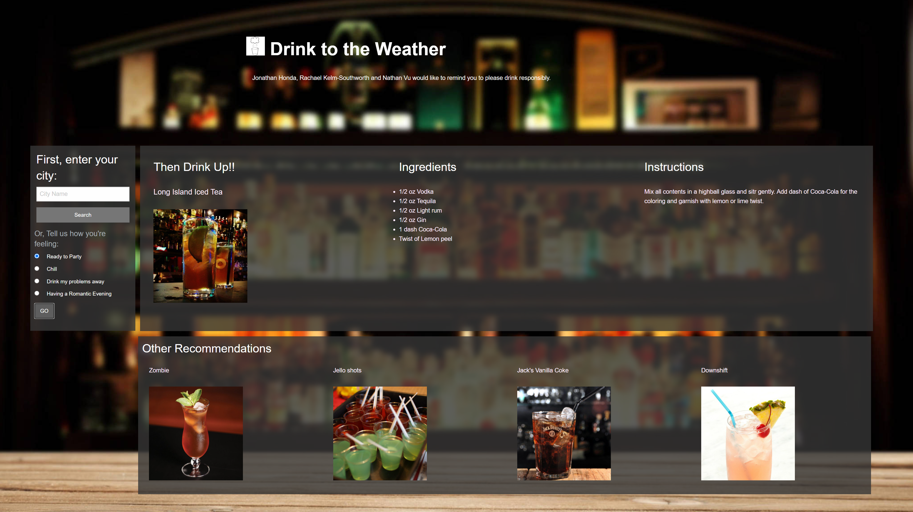
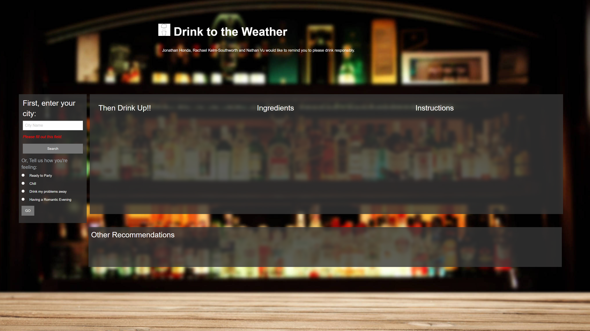

#  Drink to the Weather

### A simple app that assists with choosing a cocktail based off of the weather or your mood.
<!-- Add finished image here -->

## Table of Contents
* [Getting Started](#getting-started)
* [Technologies Used](#technologies-used)
* [Description](#description)
* [Features](#features)
* [Usage](#usage)
* [Authors](#authors)
* [Credits](#credits)
* [License](#license)

## Getting Started
* [Github Repository](https://github.com/nathanmvu/drink-to-the-weather)
* [Deployed Site](https://nathanmvu.github.io/drink-to-the-weather/)
* [Usage Demo Video](https://drive.google.com/file/d/1nJfEEpSMoe0ZTnk4FqZk68SVxq1ILuXf/view)

## Technologies Used
* HTML (32.0%)
* CSS (20.0%)
* Javascript (48.0%) 
* [Foundation](https://get.foundation/index.html)
* [Bouncer.js](https://github.com/cferdinandi/bouncer/)
* [jQuery](https://api.jquery.com/)
* [OpenWeather API](https://openweathermap.org/api)
* [Cocktail DB](https://www.thecocktaildb.com/)

## Description

The Drink to the Weather application has many features in order to simplify the drinking experience. It primarily features the CocktailDB API which contains information on hundreds of cocktails which is used in order to search and get information on drinks which are recommended to the user. On the initial page, the user is greeted with a search column which allows them to either input a city name or to select a mood they are feeling to which the webpage will recommend them a drink. If they are not completely satisfied with the first recommended drink, they also have the option to select from 4 other drinks from the "Other Recommendations sections below the main drink information area. Clicking the image of any of the drinks in this section will pull that drink up to the main information section and show the information of the selected drink to the user. The recommendation for drinks based on weather is based off of the temperature for the inputted city which is from a list of drinks that we consider appropriate for cold, average, and hot weather.

## Features 

### __1.An area to input your city or your mood__

Our input card functions much like a bartender would. It asks you how you feel, where you from and will use a bouncer(js) if it has to. In order to avoid the bouncer.js you need to enter in at least 3 characters or it will alert you in red below the input field.  

### __2. An area for the drink, ingredients and instructions__

We wanted to create a responsive tablet that gives you all the information you need for drinks as well as displaying some information on the weather if applicable. When the user inputs a city, the average weather temperature for the city will show up below the instructions section of the page.
 
### __3. Other possible recommendations area__

Just like at a bar, you may decide the first drink you see doesn't sound to good. Don't like pineapple or have milk in your fridge to make the first drink? No problem, just like an experienced bartender, we got this. We have 4 more drinks you could make that will match your mood perfectly. 

### __4. Other__

 __For later builds__

_Add an api that shows you where you can buy ingredients for the items_

We understand many users may not have a full bar at their homes to make every drink, so we would like to help them seek out the ingredients to help them make the perfect cocktail.

_Include an Api that automatically uses your ip address to search your city_

Who has the time to search? With that busy go-go quarantine lifestyle, we no longer have the time or energy to actually type in the name of my city. We want our website to do the work for you. It might be best to have the user be able to correct any errors that the automatic system makes or add additional cities but where we can remove work and add fun, we should. 

_The ability to toggle what you want to see_

I have never cared too much about windspeed but I desperately want to know what places feel like- if only there was some way to replace the windspeed with temperature feel and then have the computer save my settings so I don't have to go back every time. I don't exactly know what this would look like but I think it would really improve the usability of this product. 

## Usage
### This is meant for either the seasoned cocktail drinker to get that bar experience at home or the newbie looking to expand their repertoire of mixed alcoholic beverages.

## Screenshots

Initial Page:

Location Search:

Party Drinks:

Recommendation Selected:

Bouncer:

## Authors
 Jonathan Honda: 
 
* [linkedin] (www.linkedin.com/in/jonathan-honda-778430153) 

* [github] (https://github.com/hondahelix) 
 
 
 Rachael Kelm-Southworth: 

* [linkedin] (https://www.linkedin.com/in/rachael-kelm-southworth-87a3831b3) 

* [github] (https://github.com/RKSouth/)

Nathan Vu:

* [linkedin] (https://www.linkedin.com/in/nathan-vu/) 

* [github] (https://github.com/nathanmvu)

 ## Credits

We would like to thank Kerwin, Manuel, Roger, and all of our classmates for helping us understand this subject matter and anyone that contributed to make the base code.

## License
[MIT](https://choosealicense.com/licenses/mit/)

